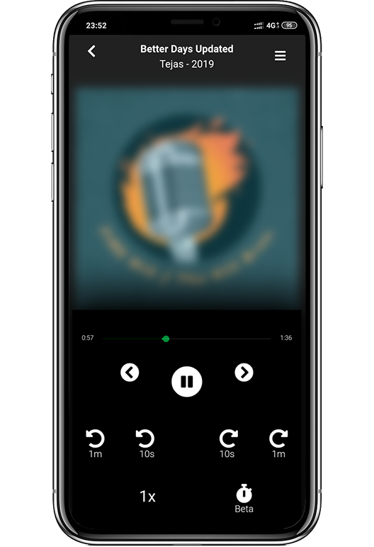

## Hello there!

## Screenshot:

## How to use?

1. Open [this link](https://codingcreate101.github.io/Shruti) on Chrome on your cellphone -

    Link: [https://codingcreate101.github.io/Shruti/](https://codingcreate101.github.io/Shruti)

    You can directly use on Chrome, however, follow [these steps](https://github.com/CodingCreate101/BhagavadGeeta-App/blob/master/screenShots/Steps_Final.png) or read along for more convenient method.

    
1. Tap on Menu button(three-vertical dots) at `top-right-corner` of Chrome App.
1. Tap on `Add to Home screen` option.
1. Tap `Add` on a new pop-up.
1. Tap `ADD` again.
1. That's it. Go back to your home screen and you should be able to see a new App Icon(refer [this image](https://github.com/CodingCreate101/BhagavadGeeta-App/blob/master/screenShots/Steps_Final.png)).

**Alrighty! Now you can use this 'App' as any regular application on your smart-phone. Even better, no need to update; you will have to latest version - always.**

----

## "Technologies" used:
1. ReactJS
1. Redux state management
1. MDBootstrap
1. Custom CSS
1. Browser localstore
1. Thunk middleware
1. DB: Google Firestore
1. Auth: Google Firebase
1. Host: Github pages

----

